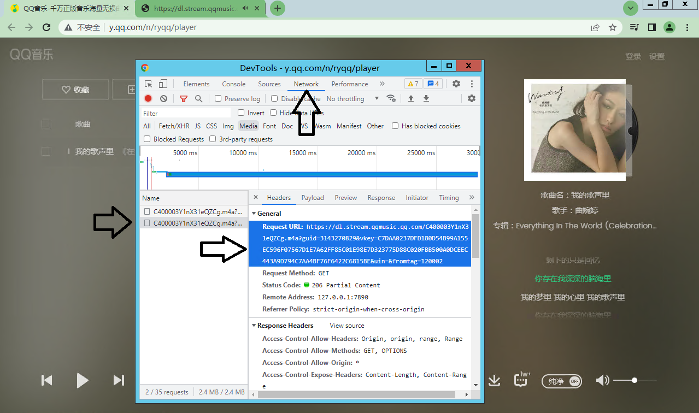

# 使用 How
## 1.  exe下载,前往[releases](https://github.com/Beadd/MusicDownloader/releases)直接下载使用,无法使用请用下面的方法
## 2.  前往[releases](https://github.com/Beadd/MusicDownloader/releases)下载MusicDownloader.py
注:需要requests库支持
```
pip install requests
```
_eyeD3的为有对歌曲添加元数据的版本,选需
```
pip install eyeD3
```
下载zip文件进入
```bash
cd PYTHON
python MusicDownloader.py
```
所下载的文件对应目录,MusicB音频目录,LyricB歌词目录,想更改下载文件夹名可以分别更改全局变量里的MusicDirName和LyricDirName。

# 进度 Progress
还在深挖突破QQ音乐VIP的瓶颈,目前只能下载网易音乐VIP歌曲,如果你有任何的建议可以直接Issues！

- [x] 网易云音乐下载
- [x] 网易云歌单批量下载
- [x] 网易云会员VIP音乐下载
- [x] 网易云我喜欢的歌曲下载 
- [x] 网易云专辑下载
- [x] QQ音乐音乐下载
- [x] QQ音乐歌单批量下载
- [x] QQ音乐我喜欢的歌单下载
- [ ] 网易云歌手下载
- [ ] QQ音乐会员VIP下载

# 感谢 Thanks
- [meting-api](https://github.com/injahow/meting-api)
# 最后 Fine
感谢使用！欢迎issues催,界面以后会用C++重写,欢迎Star！

# QQ音乐ID
> ## 比如这个ID为003eZ03f3yrLl5
> 

# QQ音乐等多平台VIP歌曲下载解决方案
### 只要是在网页上你能听见的能播放全的未加密的,任何平台此方法都适用

1.  按F12或Ctrl+Shift+I打开开发者模式
2.  选择网络(Network)
3.  (打开过滤选项,)选择媒体(media)
4.  刷新网页,播放音频,出现选项(QQ音乐会在未播放前就缓存歌曲)
5.  选中其中一个,在右侧选择headers
6.  复制其中的Request URL
7.  在浏览器打开复制的URL即是音频
- (注意看时间,如果第3步有很多选项注意都看一遍)
- (下载的前提是能播放歌曲,所以此方法下载VIP的前提是你有VIP)
### (亲试QQ音乐有用,包括VIP,网易云酷狗酷我等同理！)
